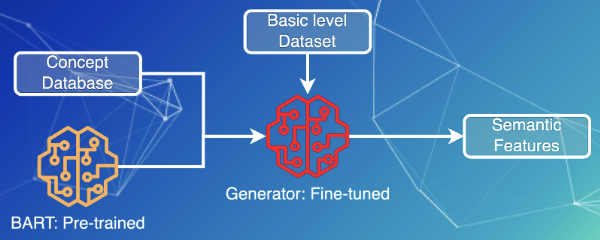

# Semantics: BART

Another way to dig out semantics of concepts is to generate English semantic features of the lemmas belonging to the concepts. The generator would be trained with the mapping of words and their English semantic features, which is inspired from machine translation.

## Reference Literature

- Synthetic Textual Features for the Large-Scale Detection of Basic-level Categories in English and Mandarin https://aclanthology.org/2021.emnlp-main.654/

- BART: Denoising Sequence-to-Sequence Pre-training for Natural Language Generation, Translation, and Comprehension https://arxiv.org/pdf/1910.13461.pdf

- English semantic feature production norms: An extended database of 4436 concepts https://link.springer.com/content/pdf/10.3758/s13428-019-01243-z.pdfhttps://link.springer.com/content/pdf/10.3758/s13428-019-01243-z.pdf

## Method

## Translation model

### Dataset

- English semantic feature data
  
  To fine-tune a pre-trained model, a dataset with cues and their semantic feature words is required. We find a relatively large database of English semantic production norms which contains 4436 concepts.

- Processing
  
  The original features of cues are in different forms. We convert them back to the dictionary form. (lemmatization) And we extract only cues and their lemmatized features as our dataset.

- Wrapping
  
  To make the training easier, we can define a class of dataset inherited from Torch Dataset to wrap the processed data into a set of dictionary. Each dictionary would be a mapping from a word to its semantic features. The dataset class could also implement the length and get item functions.

### Training

- Tokenization
  
  BART is here used as a tokenizer to obtain the token identification of each word and semantic features. The token identification is in form of tensor. It is like encoding textural information in tensor-based numerical information which contains semantics learned in BART.

- Fine-tuning
  
  Following BART, we could build a sequence-to-sequence trainer to learn the mapping in the dataset. The hyper-parameters can be seen in the arguments setting class. The metric is SacreBLEU which provides BLEU scores used to evaluate machine translation models. 

- Checkpoint
  
  We aim to save the best two fine-tuned models during training. The two will be used to translate lemmas into their semantic features.

### Generation

- Translating
  
  Using one of the best fine-tuned model, we are able to generate semantics of concepts by translating their lemmas into English semantic features. The concepts in the basic level dataset can be fully fitted in this pipeline.

## Feature Transform

Although we are able to generate semantic features, they are text-based which are not easy to learn directly. It is more reasonable to transform the textual feature into a numerical one which is could utilize the semantics.

### Statistics

The output of the generator are translated semantic features. They can be in a list of words to represent the semantics. In some cases, feature words in the translations would repeat because of redundancy of candidates predicted. The generated semantic features of a concept could be made unique and turned to a list sense. By statistics, the number of features and the number of the senses are calculated.

### Cue Validity

According to Rosch statement, cue validity can be a probabilistic indicator which the validity of a given cue as a predictor of a given category, in this project is the basic level category. 

The precise mathematical form use to compute the conditional probability has varied. Referring to Rosch ideas and some related research, we propose a conditional probability formula to calculate cue validity of a concept:

$$
CV(concept)=\sum_{cue \in semantics(concept)} P(BL|cue) = \sum_{cue} \frac{P(BL\land cue)}{P(cue)}
$$

## Model Tests

Using the benchmark, we can do the three model tests to check the improvement by the semantic features generated from BART.

### GlobalModel Test

**BART+Structural**

Kappa: 0.88077

Balanced accuracy: 0.95491

### LocalModel Test

**BART+Structural**

Kappa: 0.89768

Balanced accuracy: 0.95206

### TransferModel

**BART+Structural**

Kappa: 0.70536

Balanced Accuracy: 0.89478
